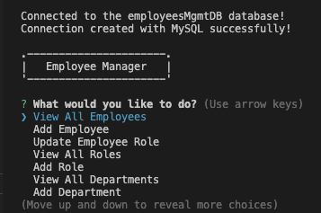

# SQL Employee Tracker


[](https://opensource.org/licenses/MIT)

## Link to GitHub Repository: 
To view the GitHub repository for "SQL Employee Tracker", please visit the following link: https://github.com/mackenzie-wentworth/sql-employee-tracker


## Description
For this week's Challenge, I was tasked to build a command-line application from scratch to support a Content Management Systems (CMS) interface for non-developer users. 

The **SQL Employee Tracker** serves as a tool for users to view and manage a company's database using `Node.js`, `Inquirer`, and `MySQL`.

---

## User Story

```md
AS A business owner
I WANT to be able to view and manage the departments, roles, and employees in my company
SO THAT I can organize and plan my business
```

## Acceptance Criteria

```md
GIVEN a command-line application that accepts user input
WHEN I start the application
THEN I am presented with the following options: view all departments, view all roles, view all employees, add a department, add a role, add an employee, and update an employee role
WHEN I choose to view all departments
THEN I am presented with a formatted table showing department names and department ids
WHEN I choose to view all roles
THEN I am presented with the job title, role id, the department that role belongs to, and the salary for that role
WHEN I choose to view all employees
THEN I am presented with a formatted table showing employee data, including employee ids, first names, last names, job titles, departments, salaries, and managers that the employees report to
WHEN I choose to add a department
THEN I am prompted to enter the name of the department and that department is added to the database
WHEN I choose to add a role
THEN I am prompted to enter the name, salary, and department for the role and that role is added to the database
WHEN I choose to add an employee
THEN I am prompted to enter the employee’s first name, last name, role, and manager, and that employee is added to the database
WHEN I choose to update an employee role
THEN I am prompted to select an employee to update and their new role and this information is updated in the database 
```


## Installation
1. In order to utilize the SQL Employee Tracker, please begin setting up your environment by making sure you have the following already installed:

    * An open source code editor, such as [VS Code](https://code.visualstudio.com/)
    * [Git Bash](https://www.educative.io/answers/how-to-install-git-bash-in-windows) or [Zsh](https://github.com/ohmyzsh/ohmyzsh/wiki/Installing-ZSH) (to use in [Git](https://github.com/git-guides/install-git) command line)
    * [Node.js](https://nodejs.org/en)
    * [MySQL](https://www.mysql.com/)

2. Next, you will need to clone this [repository](https://github.com/mackenzie-wentworth/sql-employee-tracker). From GitHub, copy the `SSH URL` and use the `git clone` command to paste the SSH URL to your terminal clipboard. 

    ```bash
        git clone [github ssh url]
    ```

3. Open the cloned repository in VS Code. Within VS Code, open a new integrated terminal and type the following `npm` command to install the [Node Package Manager](https://www.npmjs.com/):

    ```bash
        npm init -y
    ```

4. Next, type in the following `npm` command to install [Node Modules](https://docs.npmjs.com/cli/v8/commands/npm-install):

    ```bash
        npm i
    ```

---

## Usage
After you've set up your environment, you are now ready to use the SQL Employee Tracker! Please see the steps below and follow the demonstration video for further guidance to use this CMS command-line application. 

1. Open a new integrated terminal from the root directory. Type the following `mysql` commands to connect to the MySQL database, `SOURCE` schema and seeds data, and enter your `MySQL password` when prompted:

    ```bash
        mysql -u root -p
    ```

    ```bash
        SOURCE db/schema.sql;
    ```

    ```bash
        SOURCE db/seeds.sql;
    ```

    ```bash
        quit
    ```

2. Now you're ready to invoke the CLI application! In the same terminal, please type the following `npm` command:

    ```bash
        npm start
    ```

3. You should see a response in your terminal that greets you with the following:


     


4. You are now ready to select, view, and manage the database options for the SQL Employee Tracker!


### *Video Demonstration:*
[Watch video demo here!](https://user-images.githubusercontent.com/122484637/235380291-d0c2b507-6c7c-4258-a6b5-e2e3abc9a8e7.webm)

---

## Questions?
If you have any questions, please see my contact information below to reach me for inquiries:
* **GitHub**: mackenzie-wentworth, at https://github.com/mackenzie-wentworth
* **Email**: mwentworth28@gmail.com


## License
This project is covered under the [MIT License](./LICENSE). For more details, please click the license icon at the top of the page.
